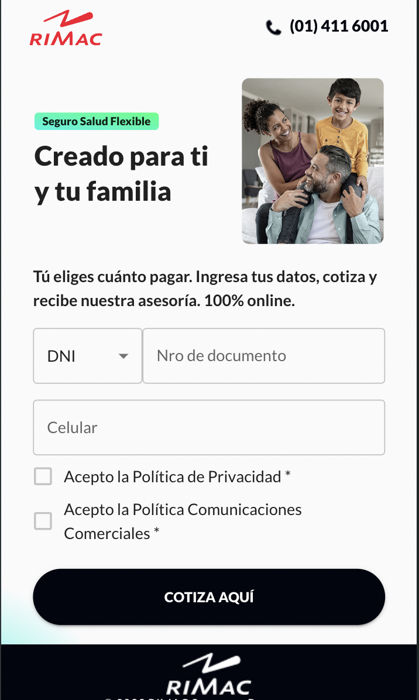
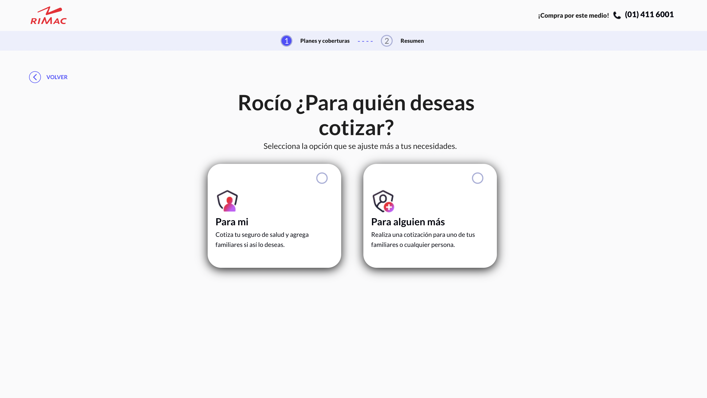
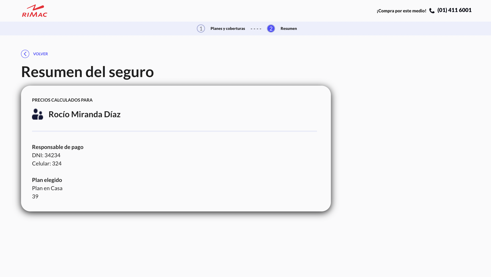

# Cotiza-app

## Project Description

Simple application to choose plans that suit your needs.




&nbsp


## Used Tools

-  <span>React</span>

-  <span>Redux</span>

-  <span>Material UI</span>

-  <span>Eslint</span>

## Another used packages

- react-router-dom v6

- sweetalert2

- axios

- redux toolkit

## How to use it

1. Clone the repository

```
git clone https://github.com/sazukeR/cotiza-app.git
```

2. Move to project folder

```
cd cotiza-app
```

3. Install project dependencies

```
yarn
```

4. Run the project

```
yarn dev
```

## MIT License

Copyright (c) 2023 Reinaldo Contreras
